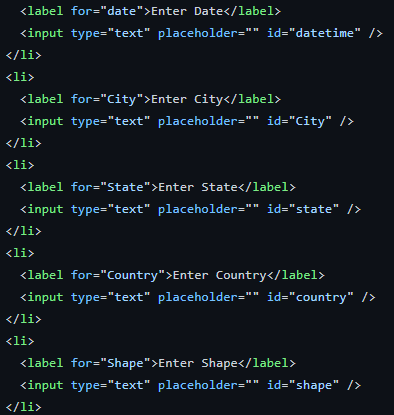
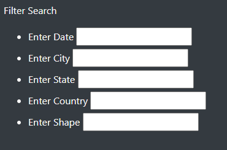
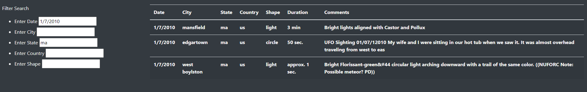

# Overview
In this project we are tasked with helping Dana finish her website that provides information on the UFO sighting. We will be JavaScript to put our website together making it more user friendly and easier to navigate though. We will create filters to help navigate through the data that was collected in 2010. 

# Results 
We started with creating our search boxes in the index.html file to help set our website with search functions. 

Next we wrote a code in our app.js file to filter through our data using changeElement and if loops to return specific resutls that the user wants to see. By adding this code we can now use our search function become alive. 

As we start to add more information to our search filters our code starts to work on gathering the information we would like to see. 

# Summary
One of the biggest drawbacks i see here is we have provided the user with many filters but not enough data. We provided sightings based on informaiton that was collected in one year. The amount of of information collected on this webiste is just not enough to keep the reader engaged. 

One of the things that always make a website look really good is more images. Not only does this help the website look more profesional it helps the story and the vision of the website come to life. By adding more imgaes it grabs the readers attention and get them more involved into what they are reading. 

More data needs to be collected. As we know UFO sightings have been around forever so if we included data from last 20 years and only use data that has made the news or went public this could significantly help improve this website. It may seem like alot more work to collect this information but i think it would be worth the extra work to make it seem more interesting for the reader.   